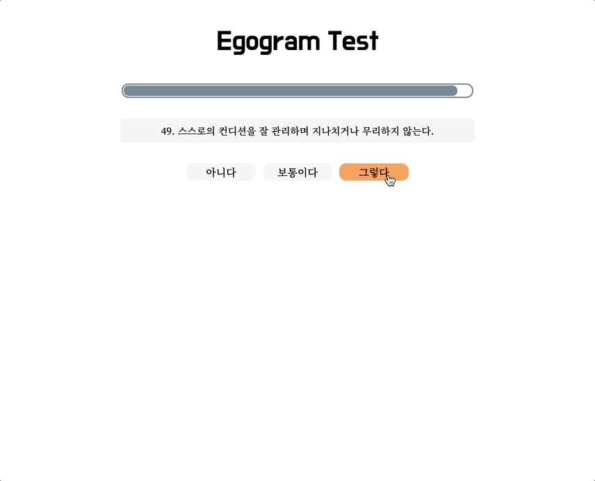

# Project : Egogram Test

* 성격유형 테스트 Egogram Test를 교육용으로 개발
* [사용자 페이지](https://www.egogram.shop/)
  - 정보 입력
  - 테스트 응답(50문항)
  - 결과화면(응답 그래프, 유형설명)
  - 카카오톡으로 공유 및 다시하기
* [관리자 페이지](https://www.egogram.shop/manager/)
  - 시행 일자 선택
  - 응답자의 정보, 응답 그래프 출력
* [사용자 가이드 문서](https://www.notion.so/choon-sik/Egogram-Test-6430c9bb12fe4003be03c36d43d35269)
  
## Tech Stack
- OS : macOS Monterey
- IDE : VS Code 1.63.2
- Language : HTML5, CSS3, JavaScript
- Library : Chart.js(p5.js -> Chart.js)
- Database : Firebase Realtime Database
- Deployment : Netlify
- API : Kakao API
- Cross Browser : Chrome 96.0, Safari 15.1
- Cross Platform : Web, Mobile

## Project Preview
### [사용자 페이지](https://www.egogram.shop/)

- 시작 화면

- 정보 입력

- 테스트 진행

- 결과 이동 -> 차트 출력

- 결과 출력

### [관리자 페이지](https://www.egogram.shop/manager/)

- 시행 일자별 실시간 데이터베이스 로드

- 차트출력 미디어 쿼리

